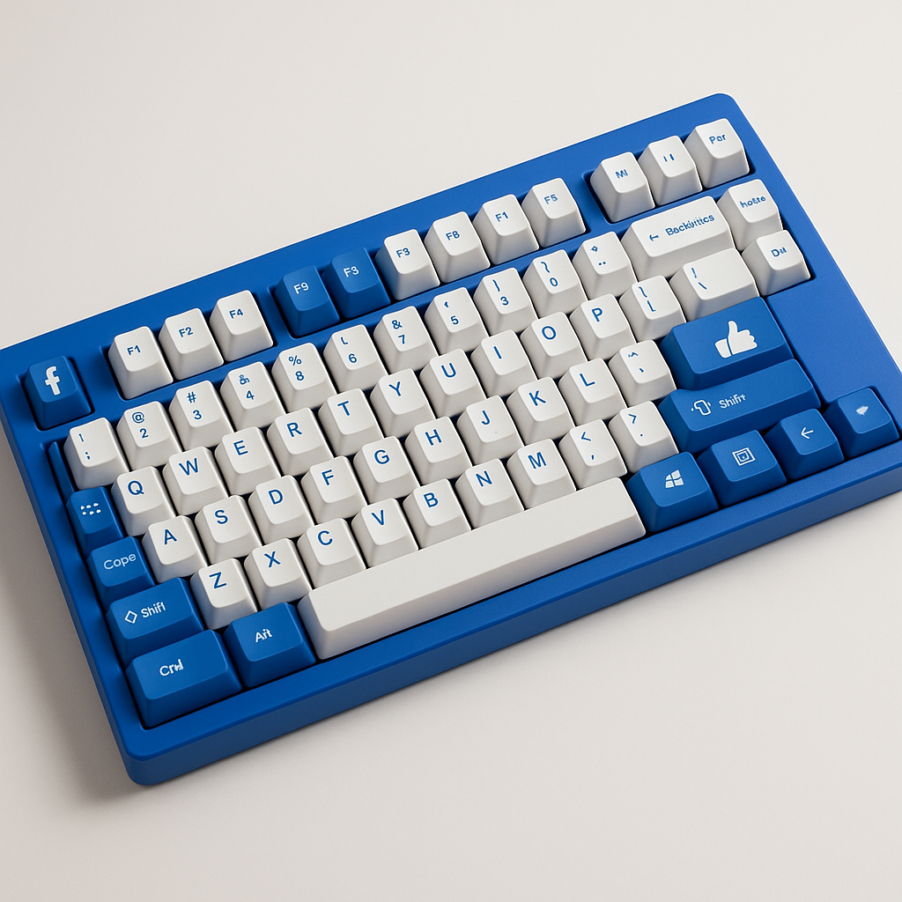

## Index{:#index}

- [Global Shortcuts](#global-shortcuts)
- [Search](#search)
- [News Feed](#news-feed)
- [Photo Albums](#photo-albums)
- [Communities](#communities)
- [Custom YouTube Shortcuts with Vind](#custom-youtube-shortcuts-with-vind)

# Mastering Facebook Keyboard Shortcuts

Facebook provides a wide range of keyboard shortcuts to speed up navigation and interaction. Below is a categorized list of essential commands with explanations to help you integrate them into your daily use.

---

## Global Shortcuts{:#global-shortcuts}

These commands let you access universal functions quickly, no matter where you are on Facebook. They’re ideal for jumping into search, reporting issues, or pulling up the full shortcut list.

| To Do This       | Use Command                |
| ---------------- | -------------------------- |
| Search Facebook  | `/` (Forward slash)        |
| Report a problem | `⌘ + b` (Command + b)      |
| Show shortcuts   | `f1`                       |
| Show shortcuts   | `⇧ + ?` (Shift + Question) |

When opening the shortcuts list you're going to see this

---

## Search{:#search}

When looking for specific content, search navigation shortcuts allow you to move between results without relying on the mouse. Use them to scan through posts, people, or pages faster.

| To Do This      | Use Command |
| --------------- | ----------- |
| Next result     | `j j`       |
| Previous result | `k k`       |

---

## News Feed{:#news-feed}

The news feed is where shortcuts shine the most. These commands give you full control over scrolling, commenting, liking, and sharing—all without touching the mouse.

| To Do This               | Use Command  |
| ------------------------ | ------------ |
| Leave a comment          | `c c`        |
| See more                 | `↩` (Enter) |
| Jump to the next post    | `j j`        |
| Previous post            | `k k`        |
| Like or unlike a post    | `l l`        |
| Open attachment of post  | `o o`        |
| Create a post            | `p p`        |
| Search Messenger contact | `q q`        |
| Share post               | `s s`        |

---

## Photo Albums{:#photo-albums}

Photo viewing can be streamlined with quick navigation keys. Move through albums, toggle fullscreen, or like images instantly.

| To Do This               | Use Command |
| ------------------------ | ----------- |
| Enter or exit fullscreen | `f f`       |
| Previous photo           | `j j`       |
| Next photo               | `k k`       |
| Like photo               | `l l`       |

---

## Communities{:#communities}

Groups and events are at the core of Facebook’s community features. These shortcuts let you switch between pinned groups, manage videos, and create new events without breaking flow.

| To Do This            | Use Command                       |
| --------------------- | --------------------------------- |
| Create an event       | `e e`                             |
| Previous video        | `⌥ + ←` (Option + Left Arrow)     |
| Next video            | `⌥ + →` (Option + Right Arrow)    |
| Previous pinned group | `⌥ + ↑` (Option + Up Arrow)       |
| Next pinned group     | `⌥ + ↓` (Option + Down Arrow)     |
| Search Communities    | `⌘ + /` (Command + Forward slash) |

---

## Custom YouTube Shortcuts with Vind{:#custom-youtube-shortcuts-with-vind}

While YouTube's native shortcuts cover core functionality, many user actions remain mouse-dependent. **[Vind](https://vind-works.io)** bridges this gap by enabling custom keyboard shortcuts for any clickable element on Facebook or any other website.

### Enhanced Engagement Controls

Create shortcuts for actions Facebook doesn't natively support:

- **Open the search bar** by pressing a single key
- **Move between tabs** like Home, Friends, Video, Marketplace and Groups without touching your mouse
- **Control the video page** with actions like Follow, See Comments or Go To Page
- **Open/close notification panels** for quick updates

### Installation and Setup

Vind works seamlessly across all websites, requiring no configuration. To create a shortcut simply click any YouTube button, assign your preferred key, and start using your custom shortcut immediately.

You can take your shortcuts everywhere by exporting them as a file or to the clipboard, this allow you to share them with friends or back them up in case you're changing browsers.

Vind is free and open source. Available for Chrome and Firefox. [Click here](#install-vind-banner) and give it a try.
