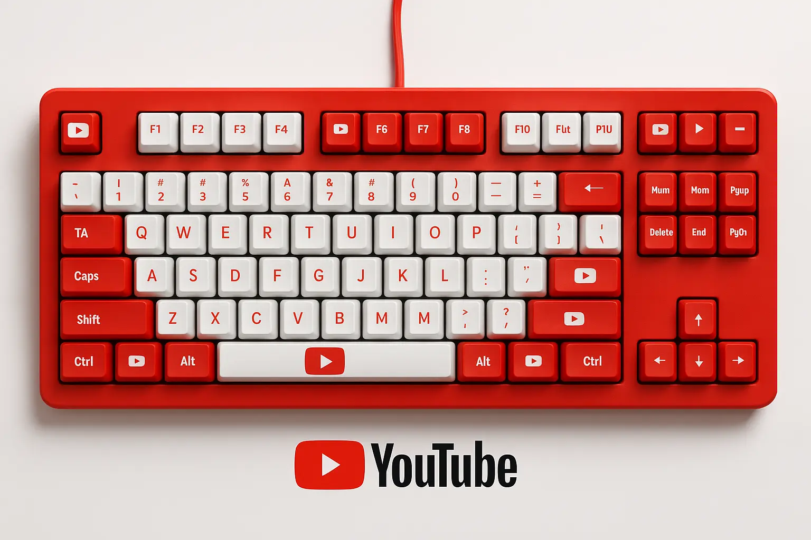
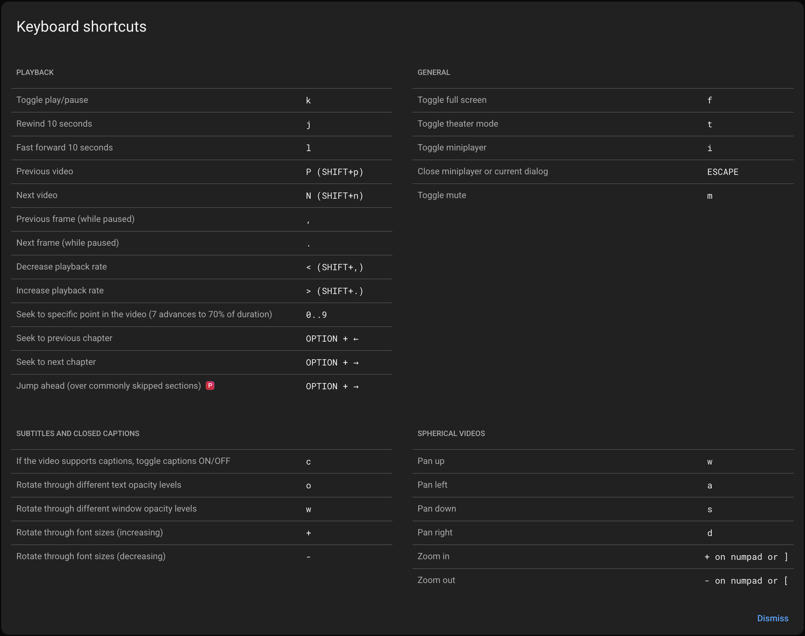
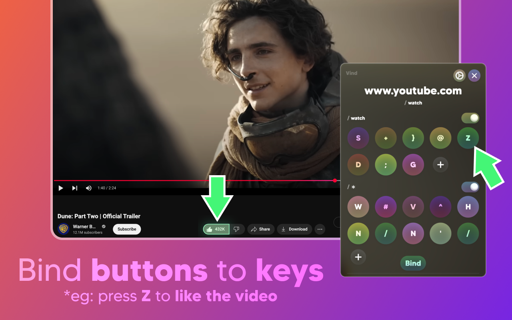

YouTube processes over 500 hours of content every minute, making efficient navigation crucial for the billions of users worldwide. Mastering keyboard shortcuts transforms your viewing experience from constant mouse clicking to second-nature keyboard control.
## Index
- [Essential Playback Controls](#essential-playback-controls)
- [Video Navigation Shortcuts](#video-navigation-shortcuts)
- [Advanced YouTube Hotkeys](#advanced-youtube-hotkeys)
- [Interface and Search Shortcuts](#interface-search-shortcuts)
- [Custom YouTube Shortcuts with Vind](#custom-youtube-shortcuts-vind)

## Essential Playback Controls{:#essential-playback-controls}

### Play, Pause, and Basic Controls

YouTube's most fundamental shortcuts center around video playback control. Press **K** or **Spacebar** to toggle play/pause instantly. The **K** key works regardless of focus, while Spacebar requires careful positioning to avoid accidentally triggering highlighted buttons.

Volume control becomes effortless with **M** for mute/unmute and the **Up/Down arrow keys** to adjust volume by 5% increments. This eliminates the need to hover over tiny volume sliders during critical moments.

### Speed Control for Efficient Viewing

Playback speed adjustment represents one of YouTube's most powerful productivity features. Use **Shift + >** to increase speed and **Shift + <** to decrease speed. Speed ranges from 0.25x (quarter speed) to 2x (double speed), perfect for tutorials requiring detailed attention or lengthy content that needs acceleration.

### Frame-by-Frame Precision

For detailed analysis, YouTube offers frame-by-frame navigation. First pause the video with **K**, then use the **period (.)** key to advance one frame forward or **comma (,)** to step backward one frame. This functionality proves invaluable for content creators, researchers, and anyone analyzing video details.

## Video Navigation Shortcuts{:#video-navigation-shortcuts}

### Time-Based Navigation

YouTube provides multiple methods for temporal navigation. The **J** and **L** keys offer 10-second jumps backward and forward respectively, while **Left/Right arrow keys** provide more granular 5-second movements.

For precise positioning, number keys **0-9** jump to specific video percentages - **0** returns to the start, **5** jumps to the middle, and **9** advances to 90% completion. This system enables instant access to any video section without scrubbing.

### Chapter Navigation

Modern YouTube videos often include chapters for structured content. Use **Ctrl + Right arrow** to skip to the next chapter and **Ctrl + Left arrow** for the previous chapter. Mac users substitute **Option** for **Ctrl**. This feature streamlines navigation through lengthy tutorials, podcasts, and educational content.

### Playlist Management

Navigate playlists efficiently with **Shift + N** for the next video and **Shift + P** for the previous video. These shortcuts work both within curated playlists and YouTube's suggested video sequences, maintaining viewing flow without mouse interaction.

## Advanced YouTube Hotkeys{:#advanced-youtube-hotkeys}

### Display Modes and Interface Control

YouTube offers multiple viewing modes accessible via keyboard. Press **F** to toggle fullscreen mode, **T** for theater mode, and **I** to activate the miniplayer. **Escape** exits fullscreen or closes dialog boxes.

Theater mode expands the video player while maintaining page elements, offering a compromise between standard and fullscreen viewing. The miniplayer allows video continuation while browsing other YouTube content.

### Caption and Accessibility Features

Captions enhance accessibility and comprehension for millions of users. Press **C** to toggle closed captions on or off. Advanced caption controls include **+** and **-** for font size adjustment, **O** for opacity cycling, and **W** for window transparency modification.

### 360° and VR Video Controls

For immersive 360° content, YouTube provides specialized navigation shortcuts. Use **W**, **A**, **S**, **D** keys for directional panning (up, left, down, right), with **+** and **-** for zoom control. These controls transform passive viewing into interactive exploration.

## Interface and Search Shortcuts{:#interface-search-shortcuts}

### Quick Search Access

The forward slash **/** key instantly focuses the search bar from anywhere on YouTube. This universal shortcut, common across many websites, eliminates the need to click or tab to the search field, streamlining content discovery.

### Navigation and Help

Access YouTube's complete shortcut reference by pressing **Shift + ?**. This overlay displays all available shortcuts, serving as an instant reference guide. The **Home** and **End** keys jump to video beginning and end respectively.

This is what you'll see:

## Custom YouTube Shortcuts with Vind{:#custom-youtube-shortcuts-vind}

While YouTube's native shortcuts cover core functionality, many user actions remain mouse-dependent. **[Vind](https://vind-works.io)** bridges this gap by enabling custom keyboard shortcuts for any clickable element on YouTube.

### Enhanced Engagement Controls

Create shortcuts for actions YouTube doesn't natively support:

- **Like/Dislike videos** with single keystrokes instead of precise clicking
- **Subscribe to channels** instantly without mouse targeting
- **Access channel pages** directly from any video
- **Open/close notification panels** for quick updates
- **Navigate to Watch Later playlist** with one key press
- **Jump to viewing history** without menu navigation
- **Add a keyboard shortcut** to skip ads on youtube

### Installation and Setup

Vind works seamlessly across all websites, requiring no configuration. To create a shortcut simply click any YouTube button, assign your preferred key, and start using your custom shortcut immediately.

You can take your shortcuts everywhere by exporting them as a file or to the clipboard, this allow you to share them with friends or back them up in case you're changing browsers.

Vind is free and open source. Available for Chrome and Firefox. [Click here](#install-vind-banner) and give it a try.